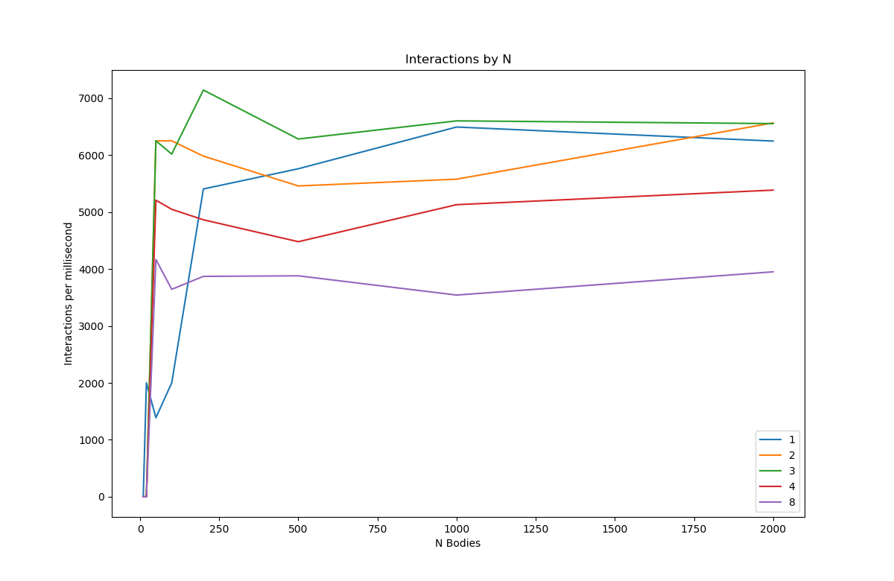

# Day 21

## Threads 1

N-body problem, measured with varying N bodies and tested for interactions per millisecond, each run using a different number of threads, seeing if running multiple M-threaded instances slows down the work.

