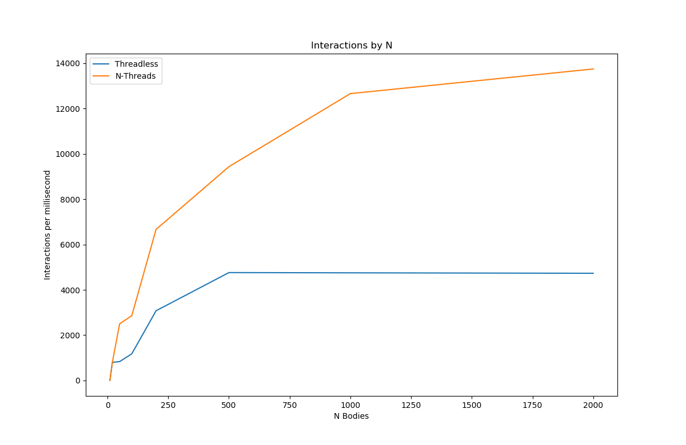

# Day 22

## Threads 2

N-body problem, measured with varying N bodies and tested for interactions per millisecond. The 2 plots show the interactions per millisecond when the program runs without threads, and when it runs with a thread per N bodies. Adding threads greatly increased the interactions per second because the work can be run simultaneously.

